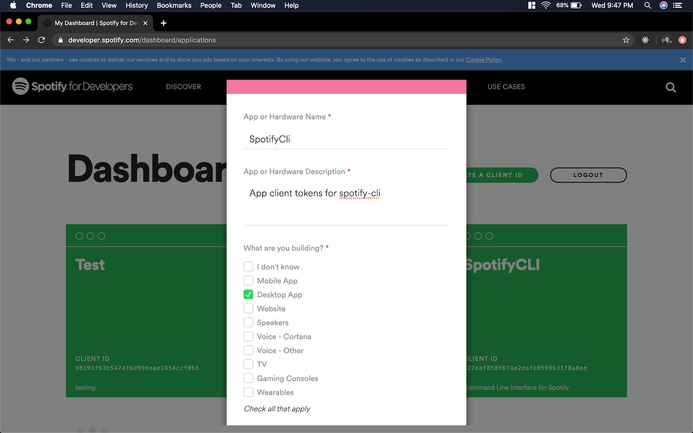
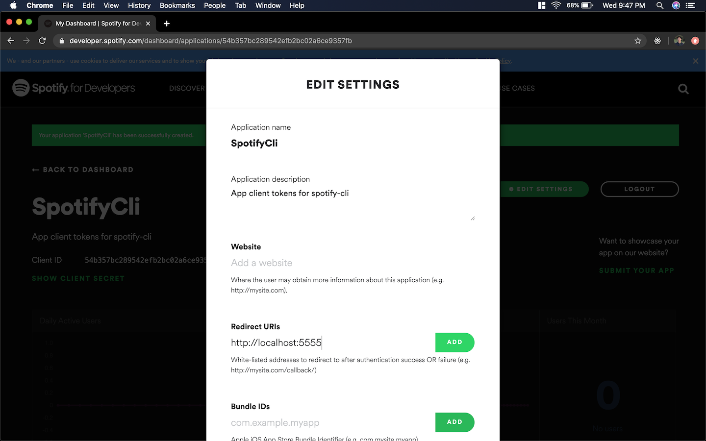
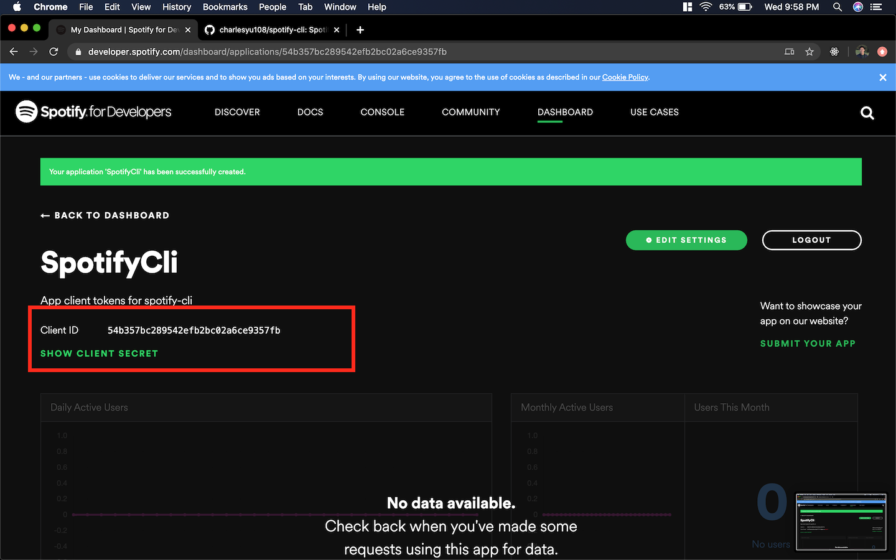

# Spotify-Cli User Manual

A system-agnostic command line utility for controlling playback on Spotify.


## What can you do with spotify-cli?

Play any of your favorite tracks / artists / albums / playlists
```
spotify-cli play --track "the less i know the better"
spotify-cli play --artist "still woozy"
spotify-cli play --album "testing"
spotify-cli play --playlist "release radar"
```

Navigate playback
```
spotify-cli play
spotify-cli pause
spotify-cli next
spotify-cli prev
spotify-cli state
spotiify-cli volume 75
```

Navigate playback (with handy aliases)
```
spotify-cli pl
spotify-cli ps
spotify-cli nx
spotify-cli pv
spotify-cli s
spotiify-cli v 75
```

Manage devices
```
spotify-cli play --device mbp
spotify-cli devices
```

## Installation

### Requirements 
* A Spotify Premium account
* A go installation. Downloads [here](https://golang.org/dl/)

### Step 1. Clone.

Clone this repository and navigate to it.
```
git clone https://github.com/charlesyu108/spotify-cli
```

### Step 2. Build & Install.
* Build the binary and install it system-wide using `go install`
(Change GOBIN to install your binary to a different location.)
```
GOBIN=/usr/local/bin go install
```

### Step 3. Register Spotify Credentials.

* Navigate to https://developer.spotify.com/dashboard/

* Create a new application and fill out the form. Make sure to select non-commercial for app type.


* Once you've created your app, click on `Edit Settings` and add a redirect uri of 
`http://localhost:XXXX` where XXXX is a port of your chosing. I like `5555`.


* Finally, reveal the Client ID and Client Secret tokens. We will be using these to configure spotify-cli.



### Step 4. Configure spotify-cli
Finally, configure spotify-cli with:
```
spotify-cli config --set-client-app-id <YOUR-CLIENT-APP-ID> --set-client-app-secret <YOUR-CLIENT-APP-SECRET> --set-redirect-port <YOUR-REDIRECT-PORT>
```

✨TADA! You're ready to go. ✨

## Usage
```
➜  ~ spotify-cli help
NAME:
   spotify-cli - Use Spotify from the Command Line.

USAGE:
   spotify-cli [global options] command [command options] [arguments...]

COMMANDS:
   help, h  Shows a list of commands or help for one command
   Configuration:
     config, c  Configure spotify-cli settings.
   Info:
     devices, d  Show playable devices.
     state, s    Show what's currently playing and playback state.
   Playback:
     play, pl   Play/Resume playback. Can also specify something to play and switch playback device.
     pause, ps  Pause playback.
     next, nx   Skip to next track.
     prev, pv   Skip to last track.
     volume, v  Adjust the volume.

GLOBAL OPTIONS:
   --help, -h  show help (default: false)
```